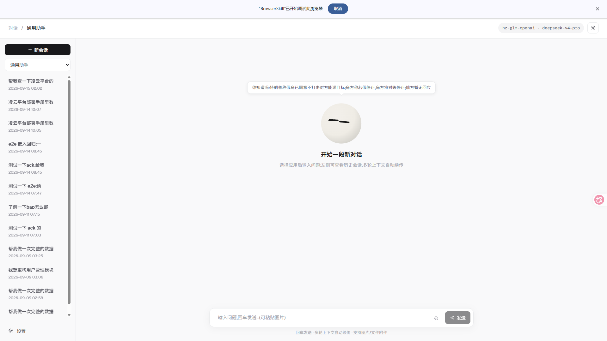
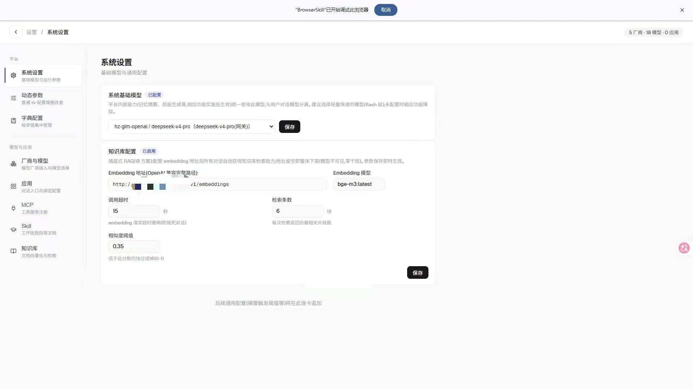
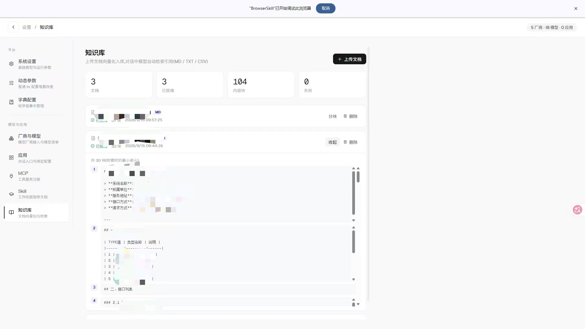
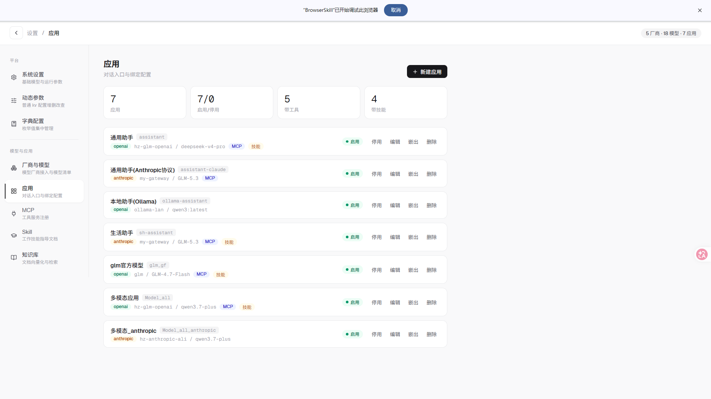
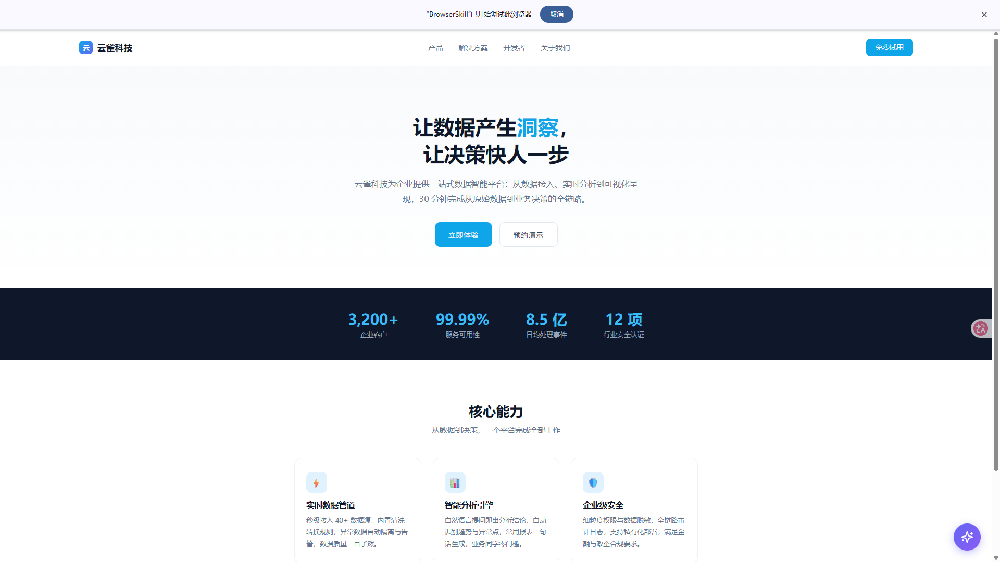
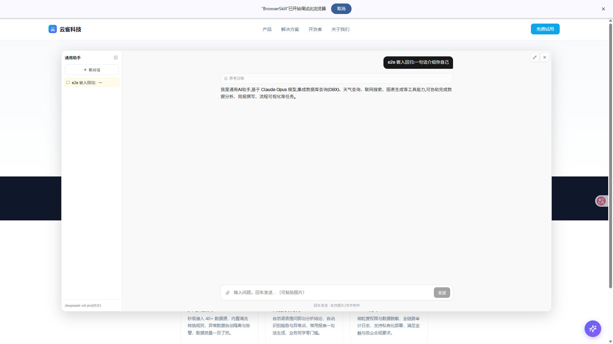

# ai_agent

一套完整的 AI Agent 能力套件：多协议模型接入 + MCP 工具生态 + Skill 业务规范 + 结构化消息 + 滚动摘要记忆 + 人机协同 ack + 任务化执行。

## ✨ 核心能力

| 能力 | 说明 |
|---|---|
| **多协议模型接入** | OpenAI / Anthropic 双协议，多厂商模型热切换（含本地 Ollama） |
| **Agent 工具循环** | 多步推理 + 工具调用（内置工具 + MCP 服务工具），步数/超时动态可配 |
| **MCP 工具生态** | MCP 服务注册、连接测试、按应用白名单绑定 |
| **Skill 业务规范** | Markdown 技能文档（注入式 / 目录式双模式），模型按指导执行业务流程 |
| **结构化消息** | content_blocks 协议：思考/正文/工具/媒体块按时序结构化存储与回放 |
| **滚动摘要记忆** | 水位线触发摘要压缩 + 四工具记忆回查（会话历史随时可查） |
| **人机协同 ack** | 高危操作确认卡（approval / choice / clarify），续跑执行 + "我的想法"自由输入 |
| **任务化执行** | 挂起-续跑-断点-取消的任务状态机 |
| **应用嵌出 Widget** | 一行 script 把任意应用挂到第三方页面（app-key 授权 + 域名白名单 + 配额 + 会话隔离） |
| **本地知识库 RAG** | 插拔式：文档上传向量化（PG + pgvector + bge-m3），对话自动检索引用，故障降级不阻断主流程 |
| **多模态输入** | 图片（多模态模型）+ 文本类附件注入 |
| **富媒体输出** | ECharts 图表 / Mermaid 流程图 / 步骤计划卡片 |

## 📸 界面预览

### 对话主界面

流式对话（思考折叠 / 工具卡片 / 媒体渲染），左侧会话历史，空态迎宾球与每日资讯。



### 系统设置

基础模型（平台内部能力）+ 插拔式知识库配置（Embedding 地址 / 检索参数，改完即时生效）。



### 知识库

文档上传 → 自动向量化（状态机推进）→ 点击查看分块明细（检索最小单元）。



### 应用管理

多应用配置：模型绑定 / MCP 工具 / 技能绑定 / 启停，一键嵌出第三方。



### 应用嵌出（Widget）

第三方页面一行 `<script>` 接入：右下角悬浮球，点击弹出对话窗口（桌面浮层 / 移动端全屏，会话独立隔离）。





## 🎨 表情小球组件

对话页的 AI 伙伴小球（迎宾/思考/使用工具/回复/出错等情绪联动）基于开源项目改造集成：

- 来源：[NX_emotion-ball](https://github.com/jackyrx/NX_emotion-ball)（fork of [aora-bot](https://github.com/sam70361/aora-bot)，版权所有者 sam70361）
- 许可：**Learning & Exchange License（非商业）**——允许个人学习/研究/交流使用与修改，须注明出处；商用需联系原作者授权
- 目录：[web/public/emotion-ball/](web/public/emotion-ball/)（含原许可声明）

```js
const ball = window.EmotionBall.create(el, { size: 65 })
ball.setEmotion('39')   // 切换表情（内置表情库可扩展）
ball.bounce()           // 撒花弹跳
EmotionBall.config.list('emotion')
```

## 🛠 技术栈

- **后端**：Node.js 22 + TypeScript + Hono + Prisma（MySQL 8）+ PG/pgvector（知识库向量存储）
- **前端**：Vue 3 + Vite + Pinia + Naive UI
- **模型接入**：Vercel AI SDK v7（OpenAI / Anthropic 双协议）
- **向量检索**：Ollama bge-m3（1024 维）+ pgvector HNSW

## 🚀 快速开始

```bash
# 1. 依赖
cd ai-app-node && npm install
cd ../web && npm install

# 2. 环境变量（ai-app-node/.env）
DATABASE_URL="mysql://root:密码@127.0.0.1:3306/ai_app"     # 主业务库
PG_URL="postgres://postgres:密码@127.0.0.1:5432/ai_kb"     # 知识库向量库（可选）
PORT=8081

# 3. 初始化 + 启动
cd ai-app-node
npx prisma generate && npx prisma db push
npm run dev                                          # 后端 :8081
cd ../web && npm run dev                             # 前端 :5173
```

开始使用：设置页（/settings）→ 厂商与模型（注册厂商/添加模型/测试启用）→ 应用（绑定模型与提示词）→ 对话页选应用开聊。

知识库（可选）：设置页「系统设置」配置 Embedding 地址（OpenAI 兼容端点，如 Ollama `/v1/embeddings`）即启用；「知识库」面板上传文档自动向量化。

## 📁 项目结构

```
ai-app-node/            # 后端
├── src/
│   ├── agent/          # 对话编排：SSE 流式 / ack 续跑 / 任务化 / 上下文装配 / 摘要记忆
│   ├── tools/          # 工具体系：内置工具 / MCP 注册表 / 技能加载器
│   ├── embed/          # 应用嵌出：app-key 鉴权 + 会话隔离
│   ├── kb/             # 知识库：向量化管道 / 向量检索 / PG 直连
│   ├── server/         # 设置页 CRUD / 知识库管理路由
│   └── llm/            # 模型厂商接入与测试
web/                    # 前端（Vue 3）
├── src/
│   ├── views/          # 对话页 / 设置页（厂商·模型·应用·MCP·Skill·知识库）
│   └── api/            # axios 封装 + SSE 解析
└── public/embed/       # widget.js（第三方一行接入）
```

## 关键设计

- **插拔式知识库**：未配地址 → 工具不注册（模型不可见，零 token 占用）；服务故障 → 降级文本（对话照常）
- **嵌出隔离**：一个 app-key = 一个应用 + 一个独立会话空间（跨 key 越权 403 拦截）
- **双线演化**：主对话页与嵌入页独立演进互不影响，共享后端编排内核
- **动态配置优先**：超时/阈值/预算类参数全部入库（ai_sys_config），设置页改完即时生效

## 📄 版权与使用条款

© 2026 彭某某（17752802756@163.com）

- **允许**：个人学习、研究、技术交流用途的自由使用、修改与运行本代码
- **禁止**：未经作者书面授权，将本项目或其衍生作品用于**商业用途**（包括但不限于商业产品、付费服务、企业内部生产系统）
- **要求**：任何形式的二次分发、衍生作品或学习引用，**必须保留本版权声明与作者署名**
- 商业授权或合作洽谈请联系上述邮箱

## 🙏 致谢

本项目基于 Vue 3、Hono、Prisma、Vercel AI SDK、Model Context Protocol 等优秀开源技术构建，感谢开源社区。
